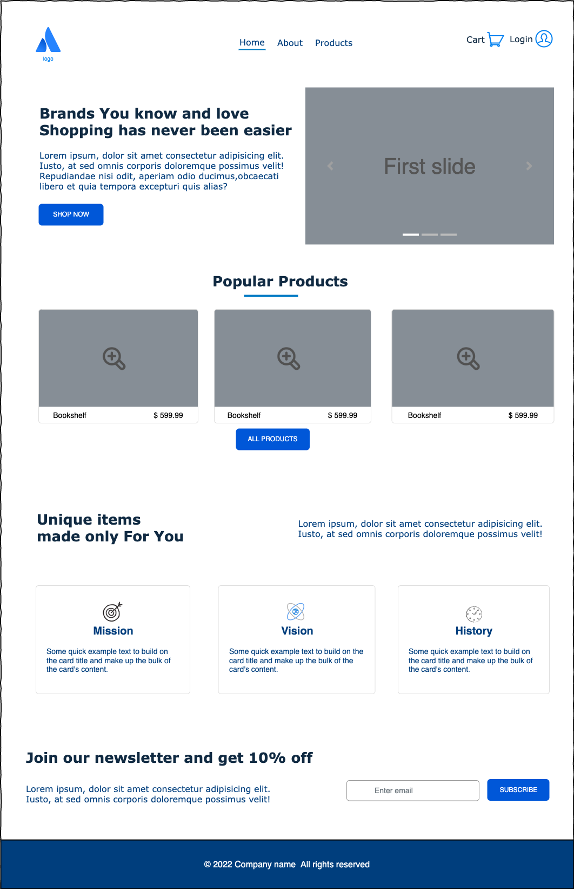
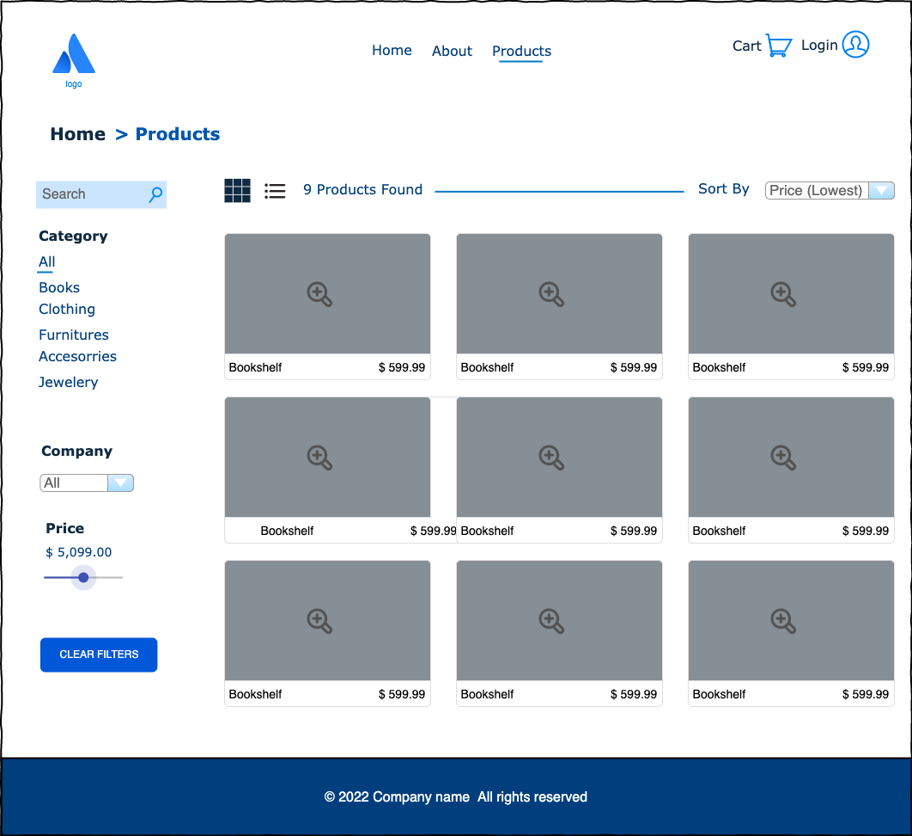
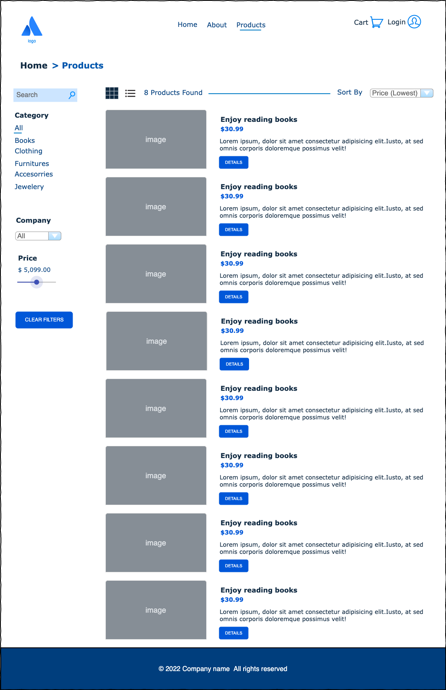
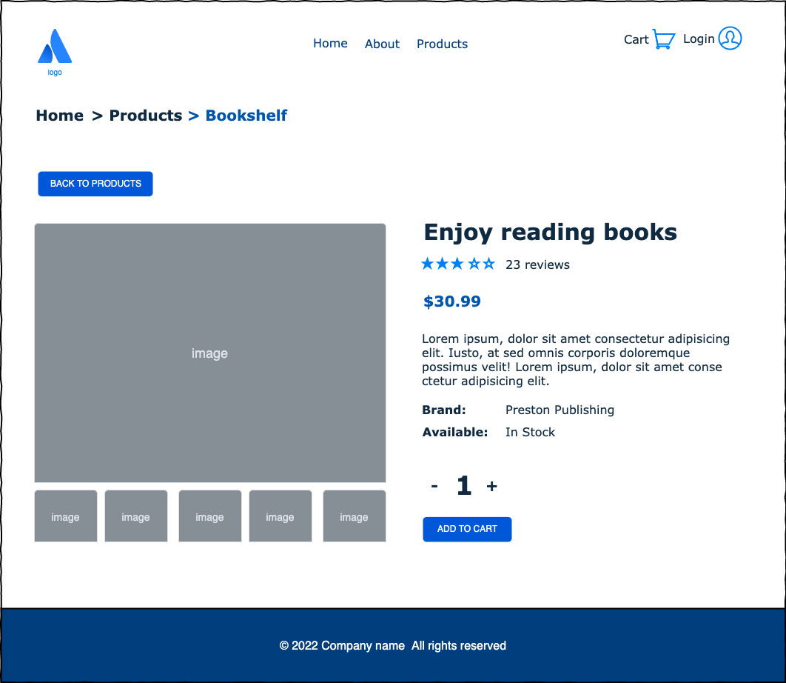
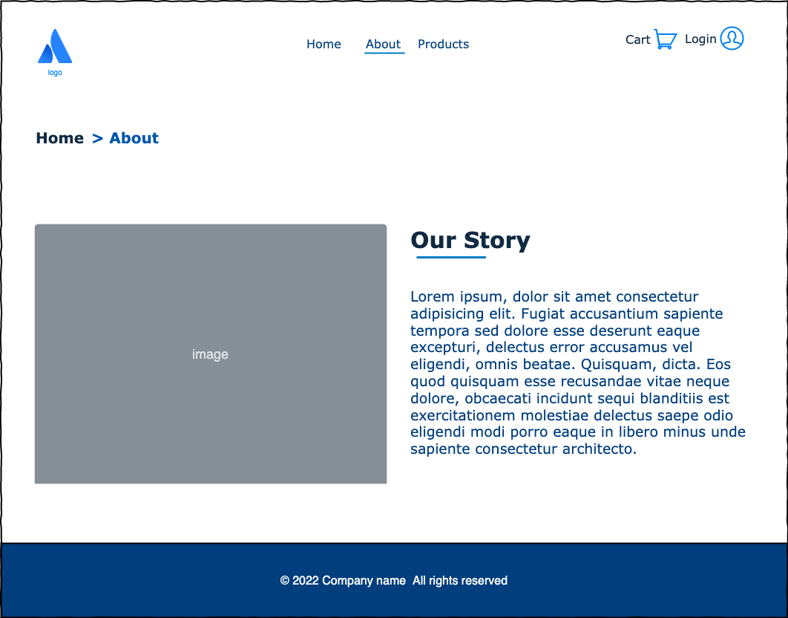
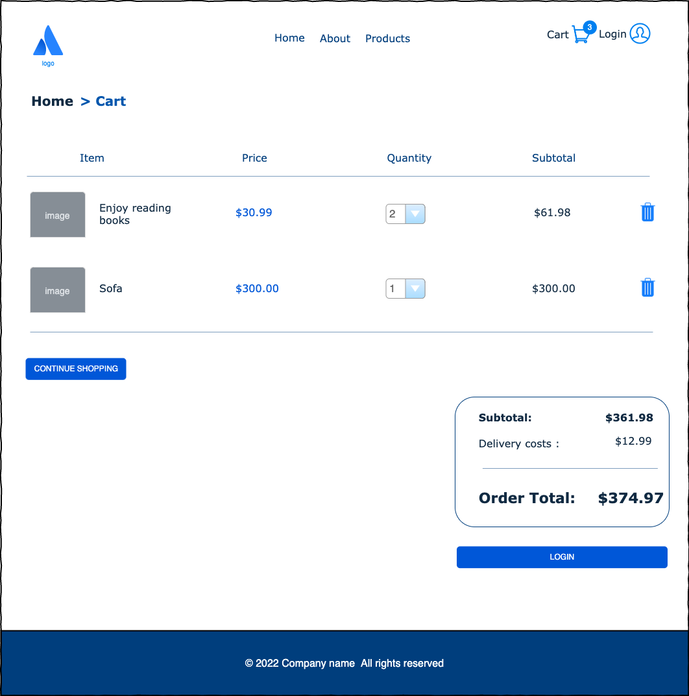

# patronage22_lublin_js_frontend _in progress_
> E-commerce application 

## Table of Contents
* [General Info](#general-information)
* [Technologies Used](#technologies-used)
* [Features](#features)
* [Figma drafts](#screenshots)
* [Setup](#setup)
* [Usage](#usage)
<!-- * [License](#license) -->

## General Information
- The goal is to delivered MVP (Minimum Viable Product)
- The scope of the project is to develope internet store functionality including the front-end web application in NextJS for browsing and adding goods to the basket
- The project is managed according to the Scrum methodology with the teamwork organized using JIRA and GitHub with peer code review including cooperation with the QA team.
<!-- You don't have to answer all the questions - just the ones relevant to your project. -->

## Technologies Used
- NextJS SSR,
- TypeScript,
- Redux
- Figma

# Other
- Formik
- React Router
- Axios
- MUI
- Prettier
- ESLint

## Features
- Views should match the design from Figma
- Access to external API
- Main Page with Hero, Featured products section, servises section and newsletter form,
- About and Contact Page
- Products Page:
  * with filtering and sorting sytem
  * search- filtering by the name, 
  * two ways of display products: list view, and grid view
- Single Product Page:
  * photos gallery
  * add to cart buuton and change amount
- Cart Page
  * change quantity
  * remove item from cart
  * clear shopping cart
  * cart summary
- Log in with Bearer Token

## Figma drafts

<!-- If you have screenshots you'd like to share, include them here. -->

## Setup

Run `npm install` to install all dependencies needed for this project. They are listed in `package.json` file.

## Usage

`npm start` - to run the app

The server is running on port 3000

### Styling

- We use styled components (https://mui.com/pt/system/styled/)

## Git-Flow

- master (production)
- develop
- feature/\*
- release/\*
- bugfix/\*
- hotfix/\*

## Contributors

[@Edyta2801](https://github.com/Edyta2801)

[@DmytroTarasiuk](https://github.com/DmytroTarasiuk)

[@kamilszalast](https://github.com/kamilszalast)

### Team Leader

[@dblach-intive](https://github.com/dblach-intive)
